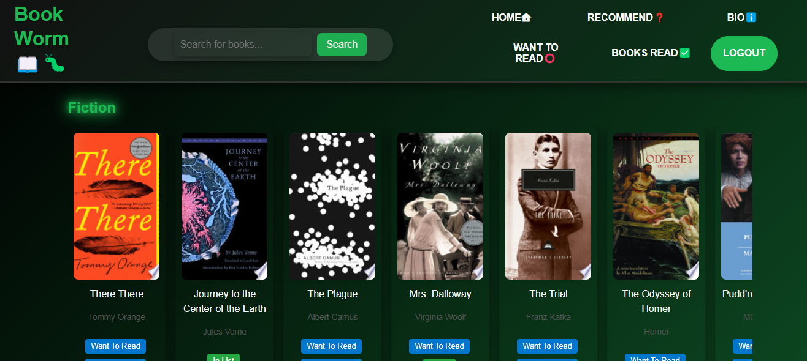

# 📚 BookWorm Tracker & Recommender

Welcome to **BookWorm**, your new favorite sidekick for all things books! Whether you're a reading machine or just dipping your toes into the literary world, BookWorm helps you **track what you've read**, **save what you want to read**, and **discover amazing new books** tailored just for you.

## 🐛 What is BookWorm?

**BookWorm** is a fun, interactive web app that allows users to:

- 📘 Log books they’ve read  
- 📗 Save books they want to read  
- 🌟 Get AI-powered recommendations based on their tastes  
- 🎨 Enjoy a slick, neon-green-on-black, Netflix-style interface

## 🚀 Features

- 📝 **Reading Tracker** – Keep a list of books you’ve conquered  
- 📚 **Reading Wishlist** – Organize your literary goals  
- 🤖 **Smart Recommendations** – Get suggestions powered by the Google Books API  
- 💡 **Interactive UI** – Genre-based horizontal sliders and glowing buttons  
- 🧠 **Built with React & Express** – Seamless full-stack experience

## 🛠️ Tech Stack

- **Frontend**: React, Tailwind CSS, JavaScript  
- **Backend**: Node.js, Express.js  
- **Database**: PostgreSQL with Sequelize  
- **Authentication**: JSON Web Tokens (JWT)  
- **APIs**: Google Books API  
- **Deployment**: Render

## 💾 How to Use Locally
# In one terminal, start the backend
- cd server
- npm run dev

# In another terminal, start the frontend
- cd client
- npm run dev

## Installation 
# Clone the repo
- git clone https://github.com/P2T4-Team4/Book-Worm
- cd bookworm

# Install backend dependencies
- cd server
- npm install

# Install frontend dependencies
- cd ../client
- npm install

## Live site
- https://book-tracker-p0b4.onrender.com/
